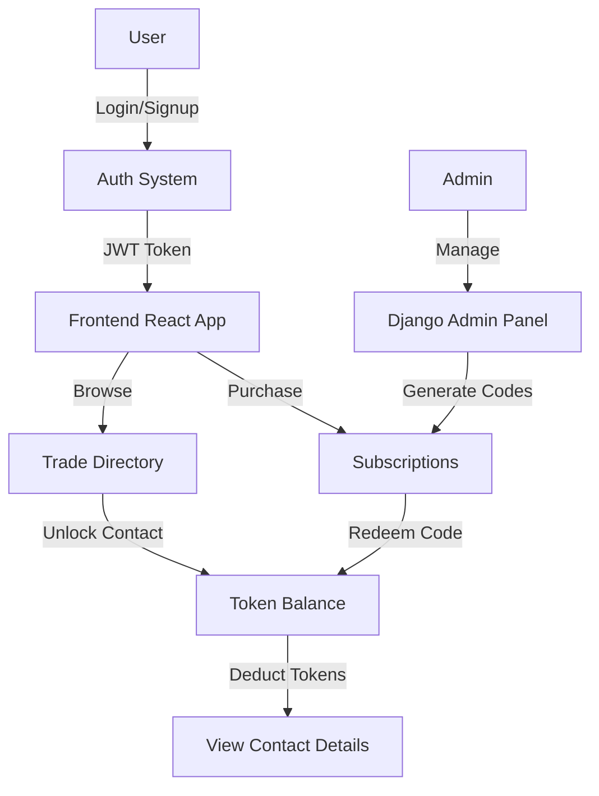

# ZaraiLink - Complete System Documentation

**Version:** 1.0  
**Last Updated:** November 24, 2025

---

## Table of Contents

1. [Project Overview](#1-project-overview)
2. [System Architecture](#2-system-architecture)
3. [Prerequisites & Installation](#3-prerequisites--installation)
4. [Database & Models](#4-database--models)
5. [Running the System](#5-running-the-system)
6. [Admin Dashboard](#6-admin-dashboard)
7. [API Endpoints Reference](#7-api-endpoints-reference)
8. [Frontend User Guide](#8-frontend-user-guide)
9. [Testing Guide](#9-testing-guide)
10. [Troubleshooting](#10-troubleshooting)

---

## 1. Project Overview

### What is ZaraiLink?

ZaraiLink is a **B2B Agricultural Trade Directory Platform** that connects buyers and suppliers in the agricultural sector. The platform provides:

- 🔍 **Company Discovery**: Search and filter agricultural companies by region, sector, and type
- 📊 **Market Intelligence**: Access to trade data and market insights
- 🎫 **Token-Based Unlocking**: Credit system to unlock premium company contacts
- 💳 **Subscription Plans**: Monthly and annual plans with varying token allocations
- 🎟️ **Redeem Code System**: Simplified payment alternative using redemption codes

### Tech Stack

**Backend:**
- Django 4.2.7 (Python 11.3.12)
- Django REST Framework 3.14.0
- PostgreSQL Database
- JWT Authentication (djangorestframework-simplejwt)
- CKEditor for rich text (django-ckeditor)

**Frontend:**
- React 19.2.0
- React Router DOM 7.9.6
- Axios 1.13.2
- Context API for state management

---

## 2. System Architecture

### Project Structure

```
Zarailink-Code/
├── backend/                    # Django Backend
│   ├── accounts/              # User authentication & management
│   ├── companies/             # Company profiles & data
│   ├── subscriptions/         # Plans, tokens, redeem codes
│   ├── trade_data/            # Trade statistics
│   ├── market_intel/          # Market insights
│   ├── trade_directory/       # Company directory (legacy)
│   ├── static/                # Static files (CSS, admin)
│   ├── templates/             # Django templates (admin override)
│   ├── zarailink/             # Main project settings
│   └── manage.py              # Django management script
│
├── frontend/                   # React Frontend
│   ├── public/                #Static assets
│   └── src/
│       ├── components/        # React components
│       │   ├── Auth/          # Login, Signup, Email Verification
│       │   ├── Dashboard/     # User dashboard & market brief
│       │   ├── Layout/        # Navbar, Sidebar
│       │   ├── Subscriptions/ # Plans & redemption
│       │   ├── TradeDirectory/# Company listings & profiles
│       │   └── Common/        # Modals, protected routes
│       ├── context/           # AuthContext for user state
│       ├── services/          # API service helpers
│       └── App.js             # Main application component
│
└── Database: PostgreSQL (zarailink)
```

### Application Flow



---

## 3. Prerequisites & Installation

### System Requirements

- **Python:** 3.12+
- **Node.js:** 18+
- **PostgreSQL:** 14+
- **npm:** 9+
- **Git:** 2.+

### Initial Setup

#### 1. Clone the Repository

```bash
git clone <repository-url>
cd Zarailink-Code
```

#### 2. Backend Setup

```bash
cd backend

# Create virtual environment
python -m venv venv

# Activate virtual environment
# On Windows:
venv\\Scripts\\activate
# On macOS/Linux:
source venv/bin/activate

# Install dependencies
pip install -r requirements.txt
```

**requirements.txt dependencies:**
- Django==4.2.7
- djangorestframework==3.14.0
- djangorestframework-simplejwt==5.3.0
- django-cors-headers==4.3.1
- python-dotenv==1.0.0
- psycopg2-binary==2.9.11
- django-ckeditor==6.7.0
- Pillow==10.1.0

#### 3. Database Setup

```bash
# Create PostgreSQL database
psql -U postgres
CREATE DATABASE zarailink;
\\q

# Configure environment variables
cp .env.example .env
```

**Edit [.env](file:///home/rolex/Salman%20Adnan/HU%20Files/7th%20Semester/FYP/Zarailink-Code/backend/.env) file:**
```env
SECRET_KEY=your-secret-key-here
EMAIL_HOST_USER=your-gmail@gmail.com
EMAIL_HOST_PASSWORD=your-gmail-app-password
FRONTEND_URL=http://localhost:3000
```

> **Note:** For EMAIL_HOST_PASSWORD, generate an [App Password](https://support.google.com/accounts/answer/185833) from your Google Account.

#### 4. Run Migrations

```bash
# Apply database migrations
python manage.py makemigrations
python manage.py migrate
```

#### 5. Create Superuser

```bash
python manage.py createsuperuser
# Follow prompts to create admin account
```

**OR use the existing superuser:**
- Email: `admin@zarailink.com`
- Password: `adminpassword`

#### 6. Seed Database (Optional)

```bash
# Create subscription plans
python manage.py create_plans

# Generate sample redeem codes for testing
python manage.py generate_codes 1 --count 10
```

#### 7. Frontend Setup

```bash
cd ../frontend

# Install dependencies
npm install
```

### Start Development Servers

**Terminal 1 (Backend):**
```bash
cd backend
source venv/bin/activate  # or venv\\Scripts\\activate on Windows
python manage.py runserver
```
Backend runs on: `http://localhost:8000`

**Terminal 2 (Frontend):**
```bash
cd frontend
npm start
```
Frontend runs on: `http://localhost:3000`

---

## 4. Database & Models

### Django Apps & Their Purpose

| App | Purpose | Key Models |
|-----|---------|------------|
| `accounts` | User authentication, email verification, token balance | User |
| `companies` | Company profiles, contacts, unlocking | Company, KeyContact, UnlockedContact |
| `subscriptions` | Plans, purchases, redeem codes | SubscriptionPlan, UserSubscription, RedeemCode, TokenPurchase |
| `trade_data` | Import/export statistics | (Future implementation) |
| `market_intel` | Market insights, reports | (Future implementation) |

### Core Models Explained

#### 1. User Model (`accounts.User`)

Custom user model extending Django's AbstractBaseUser.

**Fields:**
- [email](file:///home/rolex/Salman%20Adnan/HU%20Files/7th%20Semester/FYP/Zarailink-Code/backend/accounts/views.py#251-282) (EmailField, unique): Primary login identifier
- `first_name`, `last_name` (CharField): User's name
- `is_verified` (Boolean): Email verification status
- [verification_token](file:///home/rolex/Salman%20Adnan/HU%20Files/7th%20Semester/FYP/Zarailink-Code/backend/accounts/models.py#43-49) (CharField): For email confirmation
- `token_balance` (Integer): Current token credits
- `is_active`, `is_staff`, `is_superuser`: Account status flags

**Methods:**
- [add_tokens(amount)](file:///home/rolex/Salman%20Adnan/HU%20Files/7th%20Semester/FYP/Zarailink-Code/backend/accounts/models.py#69-73): Add tokens to user's balance
- [deduct_tokens(amount)](file:///home/rolex/Salman%20Adnan/HU%20Files/7th%20Semester/FYP/Zarailink-Code/backend/accounts/models.py#61-68): Remove tokens from balance

**Usage Example:**
```python
user = User.objects.get(email="user@example.com")
user.add_tokens(500)  # Add 500 tokens
user.token_balance  # Check current balance
```

#### 2. SubscriptionPlan Model (`subscriptions.SubscriptionPlan`)

Defines subscription tiers and pricing.

**Fields:**
- `plan_name` (CharField): e.g., "500 Credits", "5K Credits Annually"
- [price](file:///home/rolex/Salman%20Adnan/HU%20Files/7th%20Semester/FYP/Zarailink-Code/backend/subscriptions/admin.py#165-167) (DecimalField): Plan cost
- `currency` (CharField): Default 'USD'
- `tokens_included` (IntegerField): Tokens allocated
- `description` (TextField): Plan details
- `features` (JSONField): Feature flags and limits

**Pre-configured Plans:**
1. 500 Credits - $20/month
2. 5K Credits - $100/month
3. 15K Credits - $250/month
4. 5K Credits Annually - $1000/year
5. 15K Credits Annually - $2500/year
6. 50K Credits Annually - $7500/year

#### 3. RedeemCode Model (`subscriptions.RedeemCode`)

Redemption codes for activating subscriptions without payment integration.

**Fields:**
- [code](file:///home/rolex/Salman%20Adnan/HU%20Files/7th%20Semester/FYP/Zarailink-Code/backend/subscriptions/views.py#26-78) (CharField, unique): 12-character alphanumeric code
- [plan](file:///home/rolex/Salman%20Adnan/HU%20Files/7th%20Semester/FYP/Zarailink-Code/backend/subscriptions/views.py#9-24) (ForeignKey): Associated subscription plan
- [status](file:///home/rolex/Salman%20Adnan/HU%20Files/7th%20Semester/FYP/Zarailink-Code/backend/subscriptions/admin.py#57-69) (CharField): 'active', 'redeemed', or 'expired'
- `redeemed_by` (ForeignKey to User): Who redeemed it
- `redeemed_at` (DateTimeField): Redemption timestamp
- `expires_at` (DateTimeField, optional): Expiration date

**Methods:**
- [generate_code()](file:///home/rolex/Salman%20Adnan/HU%20Files/7th%20Semester/FYP/Zarailink-Code/backend/subscriptions/models.py#147-154): Static method to create unique codes
- [redeem(user)](file:///home/rolex/Salman%20Adnan/HU%20Files/7th%20Semester/FYP/Zarailink-Code/backend/subscriptions/models.py#155-200): Redeem code for a user, add tokens, create subscription

**Status Flow:**
```
active → redeemed (when used)
active → expired (if expires_at passes)
```

#### 4. Company Model (`companies.Company`)

Represents agricultural businesses in the directory.

**Fields:**
- `name` (CharField): Company name
- `company_type` (CharField): 'buyer', 'supplier', or 'both'
- [region](file:///home/rolex/Salman%20Adnan/HU%20Files/7th%20Semester/FYP/Zarailink-Code/backend/companies/views.py#57-65) (CharField): Geographic location
- `sector` (CharField): Agricultural sector
- `description` (TextField, CKEditor): Rich text description
- `year_established` (IntegerField): Founding year
- `website` (URLField): Company website
- [email](file:///home/rolex/Salman%20Adnan/HU%20Files/7th%20Semester/FYP/Zarailink-Code/backend/accounts/views.py#251-282) (EmailField): Contact email
- `phone` (CharField): Contact phone
- [logo](file:///home/rolex/Salman%20Adnan/HU%20Files/7th%20Semester/FYP/Zarailink-Code/frontend/src/context/AuthContext.js#67-79) (ImageField): Company logo

#### 5. KeyContact Model (`companies.KeyContact`)

Important personnel within companies.

**Fields:**
- `company` (ForeignKey): Associated company
- `name` (CharField): Contact person's name
- `title` (CharField): Job title
- [email](file:///home/rolex/Salman%20Adnan/HU%20Files/7th%20Semester/FYP/Zarailink-Code/backend/accounts/views.py#251-282) (EmailField): Direct email
- `phone` (CharField): Direct phone
- `is_primary` (Boolean): Main contact flag

#### 6. UnlockedContact Model (`companies.UnlockedContact`)

Tracks which users have unlocked which contacts.

**Fields:**
- [user](file:///home/rolex/Salman%20Adnan/HU%20Files/7th%20Semester/FYP/Zarailink-Code/backend/accounts/admin.py#51-55) (ForeignKey): User who unlocked
- [contact](file:///home/rolex/Salman%20Adnan/HU%20Files/7th%20Semester/FYP/Zarailink-Code/backend/companies/serializers.py#109-117) (ForeignKey to KeyContact): Unlocked contact
- `unlocked_at` (DateTimeField): Timestamp
- `tokens_used` (IntegerField): Tokens deducted

**Purpose:** Prevents users from paying twice for the same contact.

---

## 5. Running the System

### Development Mode

#### Start Backend Server

```bash
cd backend
source venv/bin/activate
python manage.py runserver

# Output:
# Starting development server at http://127.0.0.1:8000/
# Quit the server with CONTROL-C.
```

**Backend URLs:**
- Admin Panel: `http://localhost:8000/admin/`
- API Root: `http://localhost:8000/api/`

#### Start Frontend Server

```bash
cd frontend
npm start

# Output:
# Compiled successfully!
# webpack compiled with 1 warning
# 
# You can now view frontend in the browser.
#   Local:            http://localhost:3000
```

### Management Commands

All commands are run from the `backend/` directory with the virtual environment activated.

#### 1. create_plans

Creates the 6 predefined subscription plans.

```bash
python manage.py create_plans
```

**Output:**
```
Created plan: 500 Credits
Created plan: 5K Credits
Created plan: 15K Credits
Created plan: 5K Credits Annually
Created plan: 15K Credits Annually
Created plan: 50K Credits Annually
```

#### 2. generate_codes

Generates redeem codes for a specific plan.

```bash
# Syntax:
python manage.py generate_codes <plan_identifier> --count <number>

# Examples:
python manage.py generate_codes 1 --count 10
python manage.py generate_codes "500 Credits" --count 5
python manage.py generate_codes "5K Credits Annually" --count 20
```

**Parameters:**
- `plan_identifier`: Plan ID (1-6) or exact plan name (case-insensitive)
- `--count`: Number of codes to generate (default: 10)

**Output:**
```
Generating 10 codes for plan: 500 Credits...
Successfully generated 10 codes:
ABCD1234EFGH
WXYZ5678PQRS
...
```

**Plan IDs:**
| ID | Plan Name |
|----|-----------|
| 1  | 500 Credits |
| 2  | 5K Credits |
| 3  | 15K Credits |
| 4  | 5K Credits Annually |
| 5  | 15K Credits Annually |
| 6  | 50K Credits Annually |

### Database Operations

```bash
# Create new migrations after model changes
python manage.py makemigrations

# Apply migrations
python manage.py migrate

# Reset database (CAUTION: Deletes all data)
python manage.py flush

# Open PostgreSQL shell
python manage.py dbshell
```

### Static Files

```bash
# Collect static files for production
python manage.py collectstatic

# Clear browser cache after CSS changes
# Static files are served from: backend/static/
```

---

## 6. Admin Dashboard

### Accessing the Admin Panel

**URL:** `http://localhost:8000/admin/`

**Default Credentials:**
- **Email:** `admin@zarailink.com`
- **Password:** `adminpassword`

### Admin Interface Features

The admin panel uses a **custom light theme** with:
- Clean, modern design with Inter font
- White background with green (#10b981) accents
- Easy-to-navigate interface

### Generating Redeem Codes (Admin UI)

#### Method 1: Navbar Dropdown

1. Login to admin panel
2. At the top-right, find the **"Select Plan to Generate Codes"** dropdown
3. Select a subscription plan
4. Click **"Generate 10 Codes"** button
5. Success message appears
6. Codes are visible in the Redeem Codes list

#### Method 2: Admin Actions

1. Navigate to **Subscriptions → Redeem codes**
2. Select any existing code (checkbox)
3. Choose action from dropdown:
   - "Generate 10 codes for 500 Credits"
   - "Generate 10 codes for 5K Credits"
   - ...etc
4. Click **"Go"**
5. Codes are generated instantly

### Managing Subscription Plans

**Path:** Subscriptions → Subscription plans

**Actions:**
- View all plans
- Edit pricing (click plan name)
- Modify token allocations
- Update descriptions

**Fields to Edit:**
- Plan name
- Price
- Tokens included
- Description
- Features (JSON format)

**Example Features JSON:**
```json
{
  "priority_support": true,
  "api_access": false,
  "export_reports": true
}
```

### Monitoring Redeem Codes

**Path:** Subscriptions → Redeem codes

**Filters:**
- Status (active/redeemed/expired)
- Plan
- Redeemed by (user)

**List View Displays:**
- Code
- Plan
- Status
- Redeemed by (if used)
- Redeemed at (timestamp)

**Code Statuses:**
- 🟢 **Active**: Ready to be redeemed
- 🔵 **Redeemed**: Already used by a user
- 🔴 **Expired**: Past expiration date

### Managing Users

**Path:** Accounts → Users

**Actions:**
- View all registered users
- Manually adjust token balances
- Verify email addresses
- Activate/deactivate accounts

**Important Fields:**
- Email (login credential)
- Token balance (current credits)
- Is verified (email status)
- Is staff (admin access)

### Viewing User Subscriptions

**Path:** Subscriptions → User subscriptions

**Information Displayed:**
- User email
- Subscription plan
- Status (pending/active/cancelled/expired)
- Start date
- End date
- Billing cycle

---

## 7. API Endpoints Reference

All API endpoints are prefixed with `/api/`.

### Authentication Endpoints

#### POST `/api/accounts/signup/`

Register a new user account.

**Request Body:**
```json
{
  "email": "user@example.com",
  "password": "SecurePass123",
  "first_name": "John",
  "last_name": "Doe"
}
```

**Response (201 Created):**
```json
{
  "status": "success",
  "message": "Please check your email to verify your account",
  "user": {
    "email": "user@example.com",
    "first_name": "John",
    "last_name": "Doe"
  }
}
```

**What Happens:**
1. User account created (unverified)
2. Verification token generated
3. Email sent to user with verification link
4. Token balance initialized to 0

#### POST `/api/accounts/login/`

Authenticate and receive JWT tokens.

**Request Body:**
```json
{
  "email": "user@example.com",
  "password": "SecurePass123"
}
```

**Response (200 OK):**
```json
{
  "access": "eyJ0eXAiOiJKV1QiLCJhbGc...",
  "refresh": "eyJ0eXAiOiJKV1QiLCJhbGc...",
  "user": {
    "email": "user@example.com",
    "first_name": "John",
    "last_name": "Doe",
    "token_balance": 500
  }
}
```

**Authentication:**
- Access token valid for 60 minutes
- Refresh token valid for 1 day
- Include in headers: `Authorization: Bearer <access_token>`

#### GET `/api/accounts/verify-email/<token>/`

Verify user email address.

**URL Parameter:**
- [token](file:///home/rolex/Salman%20Adnan/HU%20Files/7th%20Semester/FYP/Zarailink-Code/backend/accounts/models.py#57-60): Verification token from email link

**Response (200 OK):**
```json
{
  "status": "success",
  "message": "Email verified successfully"
}
```

### Subscription Endpoints

#### GET `/api/subscriptions/plans/`

List all available subscription plans.

**Authentication:** Not required (public endpoint)

**Response (200 OK):**
```json
[
  {
    "id": 1,
    "plan_name": "500 Credits",
    "price": "20.00",
    "currency": "USD",
    "tokens_included": 500,
    "description": "Perfect for small businesses...",
    "features": {
      "priority_support": false
    }
  },
  ...
]
```

#### POST `/api/subscriptions/redeem/`

Redeem a subscription code.

**Authentication:** Required

**Request Body:**
```json
{
  "code": "ABCD1234EFGH",
  "plan_id": 1
}
```

**Response (200 OK):**
```json
{
  "status": "success",
  "message": "Code redeemed successfully",
  "tokens_added": 500,
  "plan_name": "500 Credits",
  "new_balance": 500
}
```

**Validation:**
- Code must be active (not redeemed/expired)
- Code must match the selected plan
- User must be authenticated

**Error Responses:**

**Invalid Code (404):**
```json
{
  "status": "error",
  "message": "Invalid redeem code"
}
```

**Wrong Plan (400):**
```json
{
  "status": "error",
  "message": "This code is for '5K Credits', not the selected plan"
}
```

**Already Redeemed (400):**
```json
{
  "status": "error",
  "message": "Code is redeemed"
}
```

### Company Endpoints

#### GET `/api/companies/search/`

Search companies with filters.

**Authentication:** Required

**Query Parameters:**
- [region](file:///home/rolex/Salman%20Adnan/HU%20Files/7th%20Semester/FYP/Zarailink-Code/backend/companies/views.py#57-65): Filter by region (e.g., "Punjab", "Sindh")
- `sector`: Filter by sector (e.g., "Rice", "Wheat")
- `company_type`: Filter by type ("buyer", "supplier", "both")

**Example:**
```
GET /api/companies/search/?region=Punjab&company_type=supplier
```

**Response (200 OK):**
```json
{
  "results": [
    {
      "id": 1,
      "name": "ABC Agro Industries",
      "company_type": "supplier",
      "region": "Punjab",
      "sector": "Rice",
      "year_established": 2010,
      "website": "https://abcagro.com"
    },
    ...
  ]
}
```

#### GET `/api/companies/<id>/`

Get detailed company profile.

**Authentication:** Required

**Response (200 OK):**
```json
{
  "id": 1,
  "name": "ABC Agro Industries",
  "company_type": "supplier",
  "region": "Punjab",
  "sector": "Rice",
  "description": "<p>Leading rice exporter...</p>",
  "year_established": 2010,
  "website": "https://abcagro.com",
  "email": "info@abcagro.com",
  "phone": "+92-300-1234567",
  "logo": "/media/logos/abc.png",
  "key_contacts": [
    {
      "id": 1,
      "name": "John Smith",
      "title": "Export Manager",
      "is_unlocked": false
    }
  ]
}
```

**Note:** Contact details (email/phone) only shown if unlocked.

#### POST `/api/companies/unlock-contact/`

Unlock a key contact using tokens.

**Authentication:** Required

**Request Body:**
```json
{
  "contact_id": 1
}
```

**Response (200 OK):**
```json
{
  "status": "success",
  "message": "Contact unlocked successfully",
  "tokens_used": 50,
  "remaining_balance": 450,
  "contact": {
    "name": "John Smith",
    "title": "Export Manager",
    "email": "john@abcagro.com",
    "phone": "+92-300-9876543"
  }
}
```

**Error Responses:**

**Insufficient Tokens (400):**
```json
{
  "status": "error",
  "message": "Insufficient token balance"
}
```

**Already Unlocked (400):**
```json
{
  "status": "error",
  "message": "Contact already unlocked"
}
```

### Admin-Only Endpoints

#### POST `/api/subscriptions/generate-codes/`

Generate codes via admin navbar dropdown.

**Authentication:** Required (staff only)

**Request Body:**
```json
{
  "plan_id": 1
}
```

**Response (302 Redirect):**
Redirects to `/admin/` with success message.

---

## 8. Frontend User Guide

### Application Routes

| Route | Component | Description |
|-------|-----------|-------------|
| `/` | Login | Login page (redirects if authenticated) |
| `/signup` | Signup | Registration page |
| `/verify-email-success` | VerifyEmailSuccess | Post-verification message |
| `/forgot-password` | ForgotPassword | Password reset request |
| `/dashboard` | Dashboard | User home (protected) |
| `/subscriptions` | Subscription | View plans & redeem codes (protected) |
| `/find-suppliers` | FindSuppliers | Search suppliers (protected) |
| `/find-buyers` | FindBuyers | Search buyers (protected) |
| `/company/:id` | CompanyProfile | Company details (protected) |

### User Workflows

#### 1. Registration & Login

**Registration Flow:**
1. Navigate to `/signup`
2. Enter email, password, first name, last name
3. Click "Sign Up"
4. Check email inbox
5. Click verification link
6. Redirected to success page
7. Login with credentials

**Login Flow:**
1. Navigate to `/` (Login page)
2. Enter email and password
3. Click "Login"
4. Redirected to `/dashboard`

**Authentication State:**
- Managed by `AuthContext`
- Stored in localStorage: `access_token`, `refresh_token`, `user_data`
- Auto-logout on token expiration

#### 2. Redeeming Subscription Codes

**Step-by-Step:**
1. Login to account
2. Navigate to `/subscriptions`
3. Toggle between "Monthly" and "Annually" plans
4. Click **"Redeem Code"** on desired plan
5. Modal opens
6. Enter code (uppercase, 12 characters)
7. Click **"Redeem"**
8. Success: Tokens added, modal closes after 2 seconds
9. Error: Message displayed in modal

**Important:**
- Code must match the selected plan
- Code can only be used once
- Tokens are immediately added to balance

#### 3. Searching Companies

**Find Suppliers:**
1. Navigate to `/find-suppliers`
2. Use filter sidebar:
   - Select region (dropdown)
   - Select sector (dropdown)
   - Company type auto-filtered to "supplier"
3. Click **"Apply Filters"**
4. Results displayed as cards
5. Click company card to view profile

**Find Buyers:**
- Same process as Find Suppliers
- Company type auto-filtered to "buyer"

#### 4. Unlocking Company Contacts

**Process:**
1. Open company profile (`/company/:id`)
2. Navigate to **"Key Contacts"** tab
3. View contact list (email/phone hidden if locked)
4. Click **"Unlock for 50 tokens"** button
5. Confirmation modal appears
6. Confirm unlock
7. Tokens deducted
8. Contact details revealed
9. Contact saved in "My Unlocks" (persistent)

**Token Cost:**
- Standard contact: 50 tokens
- Primary contact: 50 tokens (same)

### Frontend State Management

**AuthContext** ([context/AuthContext.js](file:///home/rolex/Salman%20Adnan/HU%20Files/7th%20Semester/FYP/Zarailink-Code/frontend/src/context/AuthContext.js)):

**State:**
- [user](file:///home/rolex/Salman%20Adnan/HU%20Files/7th%20Semester/FYP/Zarailink-Code/backend/accounts/admin.py#51-55): Current user object
- `token balance`: Available tokens
- `isAuthenticated`: Boolean login status

**Methods:**
- [login(email, password)](file:///home/rolex/Salman%20Adnan/HU%20Files/7th%20Semester/FYP/Zarailink-Code/frontend/src/context/AuthContext.js#42-66): Authenticate user
- [logout()](file:///home/rolex/Salman%20Adnan/HU%20Files/7th%20Semester/FYP/Zarailink-Code/frontend/src/context/AuthContext.js#67-79): Clear session
- `refreshUser()`: Update user/token data
- [signup(userData)](file:///home/rolex/Salman%20Adnan/HU%20Files/7th%20Semester/FYP/Zarailink-Code/backend/accounts/views.py#38-153): Register new user

**Usage in Components:**
```javascript
import { useAuth } from '../../context/AuthContext';

function Component() {
  const { user, tokenBalance, refreshUser } = useAuth();
  
  return <div>Balance: {tokenBalance}</div>;
}
```

### Frontend Components Breakdown

**Auth Components:**
- [Login.js](file:///home/rolex/Salman%20Adnan/HU%20Files/7th%20Semester/FYP/Zarailink-Code/frontend/src/components/Auth/Login.js): Email/password form
- [Signup.js](file:///home/rolex/Salman%20Adnan/HU%20Files/7th%20Semester/FYP/Zarailink-Code/frontend/src/components/Auth/Signup.js): Registration form
- [EmailVerification.js](file:///home/rolex/Salman%20Adnan/HU%20Files/7th%20Semester/FYP/Zarailink-Code/frontend/src/components/Auth/EmailVerification.js): Verification status
- [ForgotPassword.js](file:///home/rolex/Salman%20Adnan/HU%20Files/7th%20Semester/FYP/Zarailink-Code/frontend/src/components/Auth/ForgotPassword.js): Password reset
- [ResetPassword.js](file:///home/rolex/Salman%20Adnan/HU%20Files/7th%20Semester/FYP/Zarailink-Code/frontend/src/components/Auth/ResetPassword.js): New password entry
- [VerifyEmailSuccess.js](file:///home/rolex/Salman%20Adnan/HU%20Files/7th%20Semester/FYP/Zarailink-Code/frontend/src/components/Auth/VerifyEmailSuccess.js): Post-verification page

**Layout Components:**
- [Navbar.js](file:///home/rolex/Salman%20Adnan/HU%20Files/7th%20Semester/FYP/Zarailink-Code/frontend/src/components/Layout/Navbar.js): Top navigation with user menu
- [Sidebar.js](file:///home/rolex/Salman%20Adnan/HU%20Files/7th%20Semester/FYP/Zarailink-Code/frontend/src/components/Layout/Sidebar.js): Dashboard sidebar navigation

**Dashboard Components:**
- [Dashboard.js](file:///home/rolex/Salman%20Adnan/HU%20Files/7th%20Semester/FYP/Zarailink-Code/frontend/src/components/Dashboard/Dashboard.js): Main dashboard view
- [MarketBrief.js](file:///home/rolex/Salman%20Adnan/HU%20Files/7th%20Semester/FYP/Zarailink-Code/frontend/src/components/Dashboard/MarketBrief.js): Market insights widget

**Subscription Components:**
- [Subscription.js](file:///home/rolex/Salman%20Adnan/HU%20Files/7th%20Semester/FYP/Zarailink-Code/frontend/src/components/Subscriptions/Subscription.js): Plans list with redeem modal
- [SubscriptionPage.js](file:///home/rolex/Salman%20Adnan/HU%20Files/7th%20Semester/FYP/Zarailink-Code/frontend/src/components/Subscriptions/SubscriptionPage.js): Wrapper component

**Trade Directory Components:**
- [FindSuppliers.js](file:///home/rolex/Salman%20Adnan/HU%20Files/7th%20Semester/FYP/Zarailink-Code/frontend/src/components/TradeDirectory/FindSuppliers.js): Supplier search page
- [FindBuyers.js](file:///home/rolex/Salman%20Adnan/HU%20Files/7th%20Semester/FYP/Zarailink-Code/frontend/src/components/TradeDirectory/FindBuyers.js): Buyer search page
- [CompanyProfile.js](file:///home/rolex/Salman%20Adnan/HU%20Files/7th%20Semester/FYP/Zarailink-Code/frontend/src/components/TradeDirectory/CompanyProfile.js): Company detail page
- [OverviewTab.js](file:///home/rolex/Salman%20Adnan/HU%20Files/7th%20Semester/FYP/Zarailink-Code/frontend/src/components/TradeDirectory/OverviewTab.js): Company overview section
- [KeyContactsTab.js](file:///home/rolex/Salman%20Adnan/HU%20Files/7th%20Semester/FYP/Zarailink-Code/frontend/src/components/TradeDirectory/KeyContactsTab.js): Contacts with unlock functionality

**Common Components:**
- [Modal.js](file:///home/rolex/Salman%20Adnan/HU%20Files/7th%20Semester/FYP/Zarailink-Code/frontend/src/components/Common/Modal.js): Reusable modal wrapper
- [ProtectedRoute.js](file:///home/rolex/Salman%20Adnan/HU%20Files/7th%20Semester/FYP/Zarailink-Code/frontend/src/components/Common/ProtectedRoute.js): Auth guard for routes
- [ContactUnlockModal.js](file:///home/rolex/Salman%20Adnan/HU%20Files/7th%20Semester/FYP/Zarailink-Code/frontend/src/components/Common/ContactUnlockModal.js): Contact unlock confirmation
- [TokenPurchaseModal.js](file:///home/rolex/Salman%20Adnan/HU%20Files/7th%20Semester/FYP/Zarailink-Code/frontend/src/components/Common/TokenPurchaseModal.js): (Future) Token purchase

---

## 9. Testing Guide

### Backend Testing

#### Test API Endpoints with cURL

**1. Test Signup:**
```bash
curl -X POST http://localhost:8000/api/accounts/signup/ \\
  -H "Content-Type: application/json" \\
  -d '{
    "email": "test@example.com",
    "password": "TestPass123",
    "first_name": "Test",
    "last_name": "User"
  }'
```

**2. Test Login:**
```bash
curl -X POST http://localhost:8000/api/accounts/login/ \\
  -H "Content-Type: application/json" \\
  -d '{
    "email": "test@example.com",
    "password": "TestPass123"
  }'
```

**3. Test Protected Endpoint (Plans):**
```bash
curl -X GET http://localhost:8000/api/subscriptions/plans/ \\
  -H "Authorization: Bearer YOUR_ACCESS_TOKEN"
```

**4. Test Code Redemption:**
```bash
curl -X POST http://localhost:8000/api/subscriptions/redeem/ \\
  -H "Authorization: Bearer YOUR_ACCESS_TOKEN" \\
  -H "Content-Type: application/json" \\
  -d '{
    "code": "ABCD1234EFGH",
    "plan_id": 1
  }'
```

#### Python Shell Testing

```bash
python manage.py shell
```

**Test User Creation:**
```python
from accounts.models import User

# Create user
user = User.objects.create_user(
    email='shell@example.com',
    password='password123',
    first_name='Shell',
    last_name='User'
)

# Add tokens
user.add_tokens(100)
print(user.token_balance)  # Output: 100

# Deduct tokens
user.deduct_tokens(50)
print(user.token_balance)  # Output: 50
```

**Test Code Generation:**
```python
from subscriptions.models import SubscriptionPlan, RedeemCode

# Get plan
plan = SubscriptionPlan.objects.get(id=1)

# Generate code
code = RedeemCode.generate_code()
print(code)  # e.g., "ABCD1234EFGH"

# Create redeem code
redeem_code = RedeemCode.objects.create(
    code=code,
    plan=plan,
    status='active'
)
```

**Test Code Redemption:**
```python
from accounts.models import User
from subscriptions.models import RedeemCode

# Get user and code
user = User.objects.get(email='test@example.com')
code = RedeemCode.objects.get(code='ABCD1234EFGH')

# Redeem
success, message = code.redeem(user)
print(success, message)  # True, "Code redeemed successfully"
print(user.token_balance)  # Shows added tokens
```

### Frontend Testing

#### Manual Testing Checklist

**Authentication:**
- [ ] Register new user
- [ ] Receive verification email
- [ ] Click verification link
- [ ] Login with credentials
- [ ] Logout
- [ ] Login again

**Subscriptions:**
- [ ] View Monthly plans
- [ ] View Annual plans
- [ ] Click "Redeem Code" on a plan
- [ ] Enter valid code for that plan
- [ ] Verify tokens added
- [ ] Try invalid code
- [ ] Try code for wrong plan

**Company Discovery:**
- [ ] Search suppliers by region
- [ ] Search suppliers by sector
- [ ] Apply multiple filters
- [ ] Click company card
- [ ] View company overview
- [ ] View key contacts tab

**Contact Unlocking:**
- [ ] View locked contact (no email/phone visible)
- [ ] Click "Unlock" button
- [ ] Confirm unlock
- [ ] Verify tokens deducted
- [ ] Verify contact details revealed
- [ ] Reload page - contact should stay unlocked

#### Browser DevTools Testing

**1. Check API Calls:**
- Open DevTools (F12)
- Go to Network tab
- Filter by "Fetch/XHR"
- Perform actions
- Verify requests/responses

**2. Check Console for Errors:**
- Look for red errors
- Common issues:
  - CORS errors (check backend settings)
  - 401 Unauthorized (token expired)
  - 403 Forbidden (CSRF token missing)

**3. Check Application Storage:**
- Go to Application tab
- Local Storage → http://localhost:3000
- Verify:
  - `access_token`
  - `refresh_token`
  - `user_data`

### Testing Admin Dashboard

**1. Login:**
- Go to `http://localhost:8000/admin/`
- Login with admin credentials
- Verify light theme loads

**2. Generate Codes (Dropdown):**
- Select "500 Credits" from dropdown
- Click "Generate 10 Codes"
- Verify success message
- Navigate to Redeem Codes list
- Verify 10 new codes appear

**3. Generate Codes (Admin Action):**
- Go to Redeem Codes list
- Select any code (checkbox)
- Choose "Generate 10 codes for 5K Credits"
- Click "Go"
- Verify new codes created

**4. Edit Subscription Plan:**
- Go to Subscription Plans
- Click "500 Credits"
- Change price to $25
- Save
- Verify change persists

---

## 10. Troubleshooting

### Common Issues & Solutions

#### 1. Database Connection Error

**Error:**
```
django.db.utils.OperationalError: could not connect to server
```

**Solution:**
```bash
# Ensure PostgreSQL is running
sudo systemctl start postgresql  # Linux
brew services start postgresql   # macOS

# Verify database exists
psql -U postgres -l | grep zarailink

# If missing, create it
createdb -U postgres zarailink
```

#### 2. Migration Errors

**Error:**
```
django.db.migrations.exceptions.InconsistentMigrationHistory
```

**Solution:**
```bash
# Reset migrations (CAUTION: Deletes data)
python manage.py migrate --fake-initial

# OR drop database and recreate
dropdb zarailink
createdb zarailink
python manage.py migrate
```

#### 3. Admin CSS Not Loading

**Error:**
Admin panel shows dark theme or default Django styling.

**Solution:**
```bash
# Ensure STATICFILES_DIRS is set in settings.py
# Restart Django server
# Hard refresh browser (Ctrl+Shift+R or Cmd+Shift+R)
# Clear browser cache

# If still not working:
python manage.py collectstatic
python manage.py runserver
```

#### 4. CORS Errors (Frontend to Backend)

**Error (Browser Console):**
```
Access to fetch at 'http://localhost:8000/api/...' from origin 'http://localhost:3000' has been blocked by CORS policy
```

**Solution:**
Verify [backend/zarailink/settings.py](file:///home/rolex/Salman%20Adnan/HU%20Files/7th%20Semester/FYP/Zarailink-Code/backend/zarailink/settings.py):
```python
CORS_ALLOWED_ORIGINS = [
    "http://localhost:3000",
    "http://127.0.0.1:3000",
]

CORS_ALLOW_CREDENTIALS = True
```

#### 5. 403 Forbidden on POST Requests

**Error:**
```
403 Forbidden: /api/subscriptions/redeem/
```

**Solution:**
CSRF token missing. Frontend should include:
```javascript
headers: {
  'Content-Type': 'application/json',
  'X-CSRFToken': getCookie('csrftoken'),
}
```

Verify [settings.py](file:///home/rolex/Salman%20Adnan/HU%20Files/7th%20Semester/FYP/Zarailink-Code/backend/zarailink/settings.py):
```python
CSRF_TRUSTED_ORIGINS = [
    "http://localhost:3000",
    "http://127.0.0.1:3000",
]
```

#### 6. Email Verification Not Sending

**Error:**
User doesn't receive verification email.

**Solution:**
1. Check Gmail App Password in [.env](file:///home/rolex/Salman%20Adnan/HU%20Files/7th%20Semester/FYP/Zarailink-Code/backend/.env)
2. Enable "Less secure app access" (if applicable)
3. Check spam folder
4. Verify EMAIL_HOST_USER in settings
5. Test email sending:
   ```python
   from django.core.mail import send_mail
   send_mail(
       'Test Subject',
       'Test Message',
       'your-email@gmail.com',
       ['recipient@example.com'],
   )
   ```

#### 7. Token Balance Not Updating

**Issue:**
Tokens deducted but not reflected in UI.

**Solution:**
Call `refreshUser()` after token-modifying operations:
```javascript
const { refreshUser } = useAuth();

// After redemption or unlock
await refreshUser();
```

#### 8. Frontend Can't Connect to Backend

**Error (Console):**
```
GET http://localhost:8000/api/... net::ERR_CONNECTION_REFUSED
```

**Solution:**
- Ensure backend server is running
- Check port 8000 is not in use
- Verify BASE_URL in frontend API calls

#### 9. Package Installation Errors

**Python Error:**
```
ERROR: Could not find a version that satisfies the requirement...
```

**Solution:**
```bash
# Upgrade pip
pip install --upgrade pip

# Install specific package versions
pip install Django==4.2.7

# If psycopg2 fails on Windows:
pip install psycopg2-binary
```

**Node Error:**
```
npm ERR! ERESOLVE unable to resolve dependency tree
```

**Solution:**
```bash
# Use legacy peer deps
npm install --legacy-peer-deps

# OR clear cache
npm cache clean --force
rm -rf node_modules package-lock.json
npm install
```

---

## Quick Reference Card

### Essential Commands

```bash
# Backend
python manage.py runserver          # Start server
python manage.py migrate            # Apply migrations
python manage.py createsuperuser    # Create admin
python manage.py create_plans       # Seed plans
python manage.py generate_codes 1   # Generate codes

# Frontend
npm start                           # Start dev server
npm run build                       # Production build
npm test                            # Run tests

# Database
psql -U postgres                    # Open PostgreSQL
\\c zarailink                        # Connect to DB
\\dt                                 # List tables
\\q                                  # Quit
```

### URLs

- **Frontend:** `http://localhost:3000`
- **Backend API:** `http://localhost:8000/api/`
- **Admin Panel:** `http://localhost:8000/admin/`
- **Docs:** This file

### Default Credentials

- **Email:** `admin@zarailink.com`
- **Password:** `adminpassword`

### Support

For issues not covered in this guide:
1. Check server logs (terminal output)
2. Check browser console (F12)
3. Review Django documentation
4. Check React documentation

---

**Documentation Version:** 1.0  
**Last Updated:** November 24, 2025  
**Maintained by:** ZaraiLink Development Team
