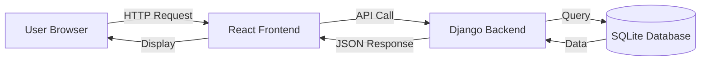

# Trade Intelligence - Complete Beginner's Guide

Welcome! This guide will walk you through **every aspect** of the Trade Intelligence module, explaining how data flows from the database to your screen.

---

## 📚 Table of Contents
1. [Architecture Overview](#1-architecture-overview)
2. [Backend Deep Dive](#2-backend-deep-dive)
3. [Frontend Deep Dive](#3-frontend-deep-dive)
4. [URL Routing Explained](#4-url-routing-explained)
5. [Complete Data Flow](#5-complete-data-flow)
6. [Code Walkthrough](#6-code-walkthrough)

---

## 1. Architecture Overview

### What is Client-Server Architecture?

Think of a restaurant:
- **Client (Frontend/React)**: You (the customer) who sees the menu and orders food
- **Server (Backend/Django)**: The waiter who takes your order to the kitchen
- **Database (SQLite)**: The kitchen where food (data) is stored and prepared



### Technology Stack

| Layer | Technology | Purpose |
|-------|-----------|---------|
| Frontend | React (JavaScript) | User interface |
| Backend | Django + Django REST Framework (Python) | API & business logic |
| Database | SQLite | Data storage |
| Communication | REST API (JSON) | Data exchange |

---

## 2. Backend Deep Dive

### 2.1 Database Models ([backend/trade_ledger/models.py](file:///d:/Salman%20Adnan/HU/7th%20Semester/FYP/Coding/backend/trade_ledger/models.py))

Models are Python classes that represent database tables. Each model becomes a table, and each field becomes a column.

#### ProductCategory Model
```python
class ProductCategory(models.Model):
    name = models.CharField(max_length=100)  # "Textiles", "Agriculture"
    description = models.TextField(blank=True)
```

**Real Example:**
| id | name | description |
|----|------|-------------|
| 1 | Textiles | Fabric and clothing items |
| 2 | Agriculture | Farm products |

#### TradeCompany Model
```python
class TradeCompany(models.Model):
    company = models.ForeignKey(Company, on_delete=models.CASCADE)
    estimated_revenue = models.DecimalField(max_digits=15, decimal_places=2)
    trade_volume = models.DecimalField(max_digits=15, decimal_places=2)
    is_exporter = models.BooleanField(default=False)
    is_importer = models.BooleanField(default=False)
```

**What this means:**
- `ForeignKey`: Links to another table (Company from trade_directory app)
- `estimated_revenue`: How much money they make ($10,000,000.00)
- `is_exporter`: Boolean flag (True/False) - do they export goods?

#### TradeProduct Model
```python
class TradeProduct(models.Model):
    company = models.ForeignKey(TradeCompany, on_delete=models.CASCADE, related_name='products')
    category = models.ForeignKey(ProductCategory, on_delete=models.SET_NULL, null=True)
    product_name = models.CharField(max_length=200)
    hs_code = models.CharField(max_length=20, blank=True)  # Harmonized System Code
    avg_price = models.DecimalField(max_digits=12, decimal_places=2)
    volume = models.IntegerField()  # Quantity traded
```

**Real Example:**
| id | company_id | product_name | hs_code | avg_price | volume |
|----|-----------|--------------|---------|-----------|---------|
| 1 | 42 | Cotton Yarn | 5205.11 | 250.00 | 50000 |

### 2.2 Serializers ([backend/trade_ledger/serializers.py](file:///d:/Salman%20Adnan/HU/7th%20Semester/FYP/Coding/backend/trade_ledger/serializers.py))

Serializers convert complex data (Django models) into simple formats (JSON) that can be sent over the internet.

**Before Serializer (Python Object):**
```python
<TradeCompany: Sialkot International Trade>
```

**After Serializer (JSON):**
```json
{
  "id": 42,
  "company": {
    "name": "Sialkot International Trade",
    "sector": "Textiles"
  },
  "estimated_revenue": "10000000.00",
  "products": [...]
}
```

**Key Serializer:**
```python
class TradeCompanySerializer(serializers.ModelSerializer):
    products = TradeProductSerializer(many=True, read_only=True)
    total_products = serializers.SerializerMethodField()

    def get_total_products(self, o):
        return o.products.count()  # Counts related products
```

### 2.3 Views ([backend/trade_ledger/views.py](file:///d:/Salman%20Adnan/HU/7th%20Semester/FYP/Coding/backend/trade_ledger/views.py))

Views handle incoming requests and return responses. They're like restaurant waiters.

**Example View:**
```python
class TradeCompanyViewSet(viewsets.ReadOnlyModelViewSet):
    qs = TradeCompany.objects.all()
    serializer_class = TradeCompanySerializer

    def get_queryset(self):
        qs = self.qs
        sector = self.request.query_params.get('sector')
        if sector:
            qs = qs.filter(company__sector__name=sector)
        return qs
```

**What happens:**
1. User requests: `/api/trade-ledger/companies/?sector=Textiles`
2. View receives request
3. View filters companies by sector
4. View serializes the data
5. View returns JSON response

### 2.4 URL Configuration

#### Main Project URLs ([backend/zarailink/urls.py](file:///d:/Salman%20Adnan/HU/7th%20Semester/FYP/Coding/backend/zarailink/urls.py))
```python
urlpatterns = [
    path('admin/', admin.site.urls),
    path('api/trade-ledger/', include('trade_ledger.urls')),  # ← Routes to trade_ledger app
]
```

**Why?** This tells Django: "If someone visits `/api/trade-ledger/anything`, send them to the `trade_ledger` app's URLs"

#### App-Level URLs ([backend/trade_ledger/urls.py](file:///d:/Salman%20Adnan/HU/7th%20Semester/FYP/Coding/backend/trade_ledger/urls.py))
```python
router = DefaultRouter()
router.register(r'companies', TradeCompanyViewSet, basename='companies')
router.register(r'product-categories', ProductCategoryViewSet, basename='categories')

urlpatterns = [
    path('', include(router.urls)),
]
```

**Full URL Breakdown:**
- Base: `http://localhost:8000`
- Project prefix: `/api/trade-ledger/`
- Router adds: [companies/](file:///d:/Salman%20Adnan/HU/7th%20Semester/FYP/Coding/backend/trade_ledger/generate_fixture_data.py#98-132)
- **Final URL:** `http://localhost:8000/api/trade-ledger/companies/`

---

## 3. Frontend Deep Dive

### 3.1 React Component Structure

```
TradeIntelligence/
├── TradeLedger.js         (Main dashboard)
├── CompanyOverview.js     (Company details)
├── CompanyProducts.js     (Products tab)
├── CompanyPartners.js     (Partners tab)
├── CompanyTrends.js       (Trends tab)
└── TradeIntelligence.css  (Styling)
```

### 3.2 State Management (React Hooks)

**State** is data that React "remembers" and re-renders when it changes.

```javascript
const [comps, setComps] = useState([]);  // Array of companies
const [load, setLoad] = useState(true);  // Is data loading?
const [filts, setFilts] = useState({     // Filter values
  sector: '',
  min_revenue: '',
  max_revenue: ''
});
```

**Variable Naming (Human-like Style):**
- `comps` = companies
- [load](file:///d:/Salman%20Adnan/HU/7th%20Semester/FYP/Coding/frontend/src/components/TradeIntelligence/CompanyProducts.js#21-32) = loading
- `filts` = filters
- `prods` = products
- `parts` = partners

### 3.3 Data Fetching (useEffect Hook)

```javascript
useEffect(() => {
  loadComps();  // Runs when component mounts
}, [filts]);    // Re-runs when 'filts' changes
```

**The [loadComps](file:///d:/Salman%20Adnan/HU/7th%20Semester/FYP/Coding/frontend/src/components/TradeIntelligence/TradeLedger.js#42-75) Function:**
```javascript
const loadComps = async () => {
  setLoad(true);
  
  // Build URL with filters
  const p = new URLSearchParams();
  if (filts.sector) p.append('sector', filts.sector);
  if (filts.min_revenue) p.append('min_revenue', filts.min_revenue);
  
  const res = await fetch(`http://localhost:8000/api/trade-ledger/companies/?${p}`);
  const data = await res.json();
  
  setComps(data);  // Update state
  setLoad(false);
};
```

**Step-by-step:**
1. Set loading to true (show spinner)
2. Create URL with filter parameters
3. Send GET request to backend
4. Wait for response
5. Convert response to JSON
6. Update `comps` state (triggers re-render)
7. Set loading to false (hide spinner)

---

## 4. URL Routing Explained

### 4.1 Backend URL Routing

**Level 1: Project URLs** ([backend/zarailink/urls.py](file:///d:/Salman%20Adnan/HU/7th%20Semester/FYP/Coding/backend/zarailink/urls.py))
```python
path('api/trade-ledger/', include('trade_ledger.urls'))
```
→ Forwards all `/api/trade-ledger/*` requests to the trade_ledger app

**Level 2: App URLs** ([backend/trade_ledger/urls.py](file:///d:/Salman%20Adnan/HU/7th%20Semester/FYP/Coding/backend/trade_ledger/urls.py))
```python
router.register(r'companies', TradeCompanyViewSet, basename='companies')
```
→ Creates these endpoints automatically:
- `GET /companies/` → List all companies
- `GET /companies/{id}/` → Get one company
- `GET /companies/{id}/products/` → Get company products (custom action)

**Custom Action Example:**
```python
@action(detail=True, methods=['get'])
def products(self, req, pk=None):
    c = self.get_object()  # Get the company
    prods = c.products.all()  # Get all related products
    ser = TradeProductSerializer(prods, many=True)
    return Response(ser.data)
```

**Why `detail=True`?** It means this action applies to a **specific company** (requires `pk` in URL)

### 4.2 Frontend URL Routing

**Main App Routes** ([frontend/src/App.js](file:///d:/Salman%20Adnan/HU/7th%20Semester/FYP/Coding/frontend/src/App.js))
```javascript
<Routes>
  <Route path="/trade-intelligence/ledger" element={<ProtectedRoute><TradeLedger /></ProtectedRoute>} />
  <Route path="/trade-intelligence/company/:id/overview" element={<ProtectedRoute><CompanyOverview /></ProtectedRoute>} />
  <Route path="/trade-intelligence/company/:id/products" element={<ProtectedRoute><CompanyProducts /></ProtectedRoute>} />
  <Route path="/trade-intelligence/company/:id/partners" element={<ProtectedRoute><CompanyPartners /></ProtectedRoute>} />
  <Route path="/trade-intelligence/company/:id/trends" element={<ProtectedRoute><CompanyTrends /></ProtectedRoute>} />
</Routes>
```

**Understanding Route Parameters:**
- `:id` is a **dynamic parameter**
- If URL is `/company/42/overview`, then `id = 42`
- Access in component via: `const { id } = useParams();`

**Navigation Example:**
```javascript
const onCompClick = (c) => {
  navigate(`/trade-intelligence/company/${c.id}/overview`);
};
```

**Tab Navigation:**
```javascript
const navTab = (t) => {
  navigate(`/trade-intelligence/company/${id}/${t}`);
};

// Usage: navTab('products') → /company/42/products
```

---

## 5. Complete Data Flow

### Example: User Clicks "Textiles" Filter

**Step 1: User Action (Frontend)**
```javascript
<select onChange={(e) => setFilts({...filts, sector: e.target.value})}>
  <option value="">All Sectors</option>
  <option value="Textiles">Textiles</option>
</select>
```

**Step 2: State Update Triggers useEffect**
```javascript
useEffect(() => {
  loadComps();  // Automatically re-runs because 'filts' changed
}, [filts]);
```

**Step 3: API Call**
```javascript
const res = await fetch('http://localhost:8000/api/trade-ledger/companies/?sector=Textiles');
```

**Step 4: Backend Receives Request** ([views.py](file:///d:/Salman%20Adnan/HU/7th%20Semester/FYP/Coding/backend/companies/views.py))
```python
def get_queryset(self):
    qs = self.qs
    sector = self.request.query_params.get('sector')  # Gets "Textiles"
    if sector:
        qs = qs.filter(company__sector__name=sector)  # SQL: WHERE sector.name = 'Textiles'
    return qs
```

**Step 5: Database Query**
```sql
SELECT * FROM trade_ledger_tradecompany
JOIN trade_directory_company ON ...
JOIN trade_directory_sector ON ...
WHERE trade_directory_sector.name = 'Textiles'
```

**Step 6: Serialization**
```python
ser = TradeCompanySerializer(qs, many=True)
return Response(ser.data)  # Converts to JSON
```

**Step 7: Frontend Receives Data**
```javascript
const data = await res.json();  // [{id: 42, company: {...}}, ...]
setComps(data);  // Updates state → React re-renders
```

**Step 8: Display Update**
```javascript
{comps.map((c, i) => (
  <div key={i} className="company-card">
    <h3>{c.company.name}</h3>
    <p>{fmtCurr(c.estimated_revenue)}</p>
  </div>
))}
```

---

## 6. Code Walkthrough

### 6.1 Creating a New Company Card

**Backend: Fetch Company Data**
```python
# views.py
class TradeCompanyViewSet(viewsets.ReadOnlyModelViewSet):
    qs = TradeCompany.objects.select_related('company', 'company__sector')
    serializer_class = TradeCompanySerializer
```

**Frontend: Display Company**
```javascript
// TradeLedger.js
{comps.map((c, i) => (
  <div key={i} className="company-card" onClick={() => onCompClick(c)}>
    <div className="company-header">
      <h3>{c.company.name}</h3>
      <span className="company-tag">{c.company.sector?.name}</span>
    </div>
    <div className="company-stats">
      <div className="stat-item">
        <span className="stat-label">Revenue</span>
        <span className="stat-value">{fmtCurr(c.estimated_revenue)}</span>
      </div>
    </div>
  </div>
))}
```

### 6.2 Tab Navigation System

**Understanding Current Tab:**
```javascript
const loc = useLocation();  // Current URL
const tab = loc.pathname.split('/').pop();  // Last part of URL

// Example: /company/42/products → tab = "products"
```

**Rendering Active Tab:**
```javascript
<button 
  className={`tab-button ${tab === 'products' ? 'active' : ''}`}
  onClick={() => navTab('products')}
>
  Products
</button>
```

**CSS Styling:**
```css
.tab-button.active {
  background: linear-gradient(135deg, #10b981, #059669);
  color: white;
}
```

---

## 7. Key Concepts Summary

### For Absolute Beginners

**What is an API?**
- A way for two programs to talk to each other
- Like a waiter taking your order to the kitchen
- Frontend says: "I need company data"
- Backend says: "Here's the company data in JSON format"

**What is JSON?**
```json
{
  "id": 42,
  "name": "Test Company",
  "products": [
    {"name": "Product 1"},
    {"name": "Product 2"}
  ]
}
```
- JavaScript Object Notation
- A format humans and computers can both read
- Like a recipe card with ingredients listed

**What is a Component?**
- A reusable piece of UI (like a LEGO block)
- `<CompanyCard />` is used multiple times with different data
- Props are inputs: `<CompanyCard company={data} />`

**What is State?**
- Data that React "remembers"
- When state changes, React re-draws the screen
- Like a whiteboard - erase and redraw when data updates

---

## 8. Common Patterns

### Pattern 1: Fetch-Display-Update
1. Fetch data from API
2. Store in state
3. Display using map
4. User interaction updates state
5. Re-fetch or update display

### Pattern 2: Master-Detail
1. List view (Trade Ledger) shows all companies
2. Click one → Detail view (Company Overview)
3. Detail view has tabs for more info

### Pattern 3: Filter-Refresh
1. User changes filter
2. useEffect detects change
3. New API call with filters
4. Display updates automatically

---

**Need Help?**
- Backend code is in `backend/trade_ledger/`
- Frontend code is in `frontend/src/components/TradeIntelligence/`
- Start with `TradeLedger.js` to understand the flow

