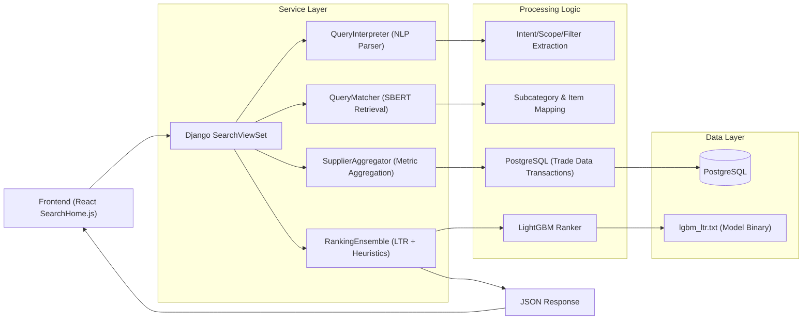
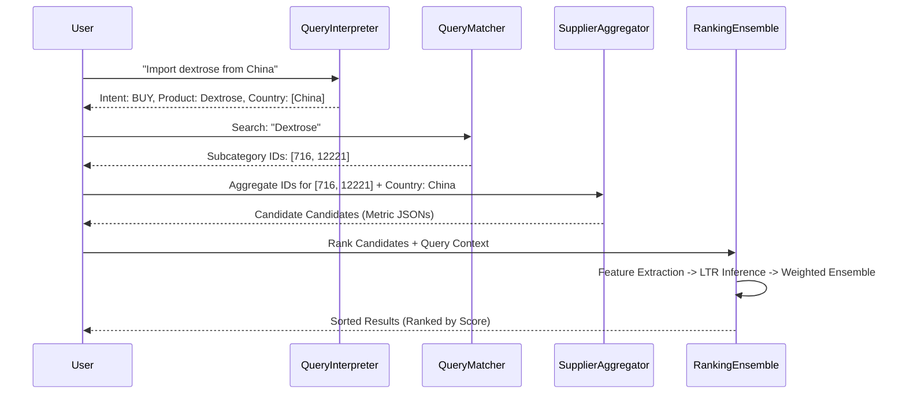
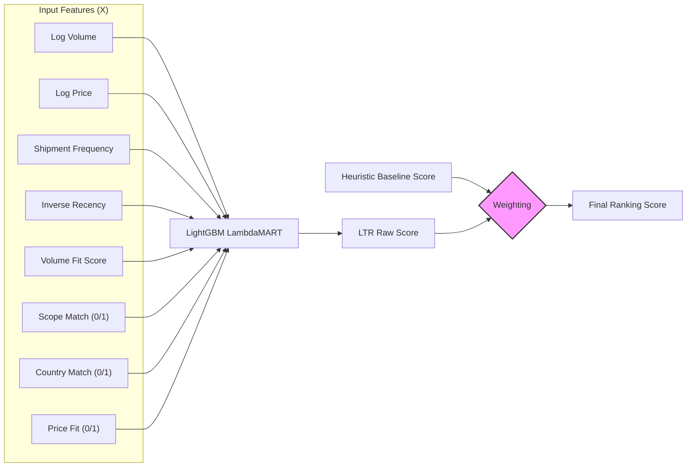
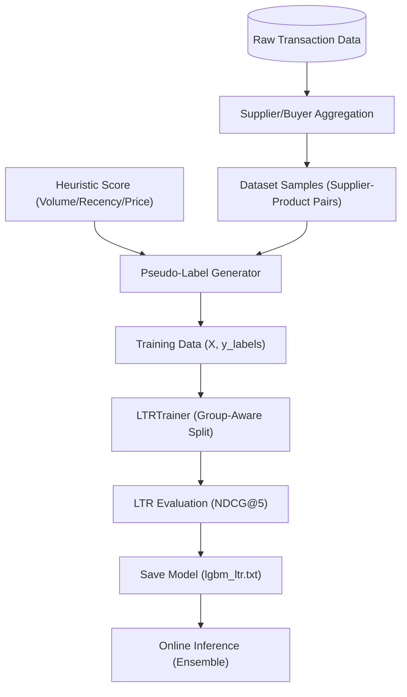

# Search Engine & Learn to Rank (LTR) Documentation

This document outlines the architecture and pipelines of the ZaraiLink search ecosystem.

## a) Search Engine Architecture

The ZaraiLink search engine follows a decoupled, service-oriented architecture designed for scalability and precision.

---

## b) Search Engine Pipeline

The pipeline processes a natural language query through several stages to produce ranked results.

---

## c) Learn to Rank (LTR) Architecture

The LTR component uses a Gradient Boosted Decision Tree (LightGBM) optimized for ranking.

---

## d) LTR Data Pipeline

The data pipeline manages the lifecycle from raw signals to model deployment.

