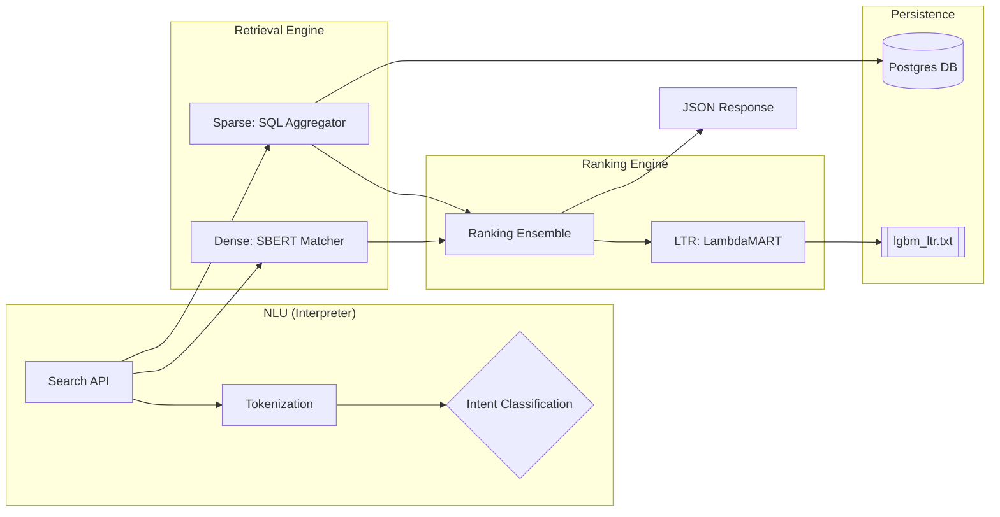
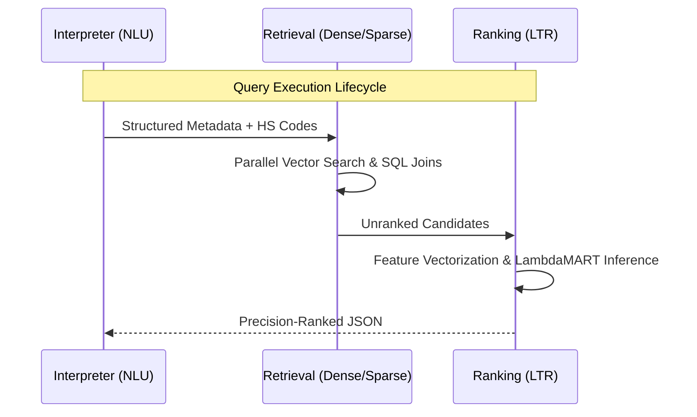
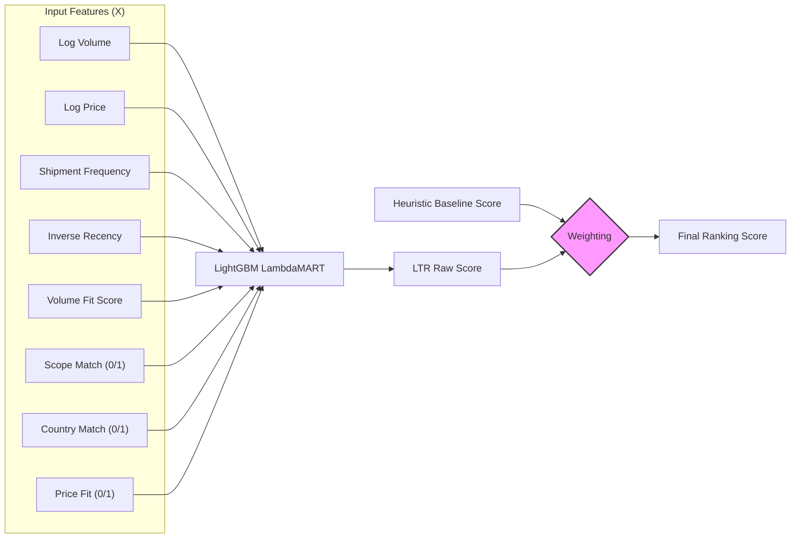
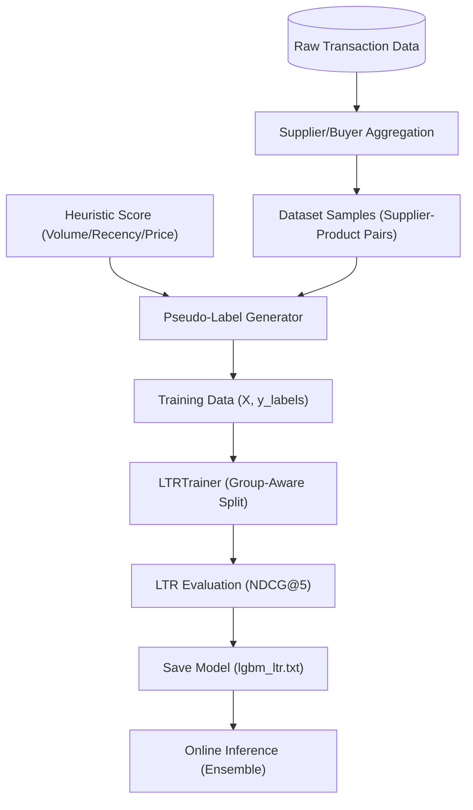

# Search Engine & Learn to Rank (LTR) Documentation

This document outlines the architecture and pipelines of the ZaraiLink search ecosystem.

## a) Search Engine Architecture (Horizontal Phases)

---

## b) Pipeline Sequence Execution

---

## c) Learn to Rank (LTR) Architecture

The LTR component uses a Gradient Boosted Decision Tree (LightGBM) optimized for ranking.

---

## d) LTR Data Pipeline

The data pipeline manages the lifecycle from raw signals to model deployment.

