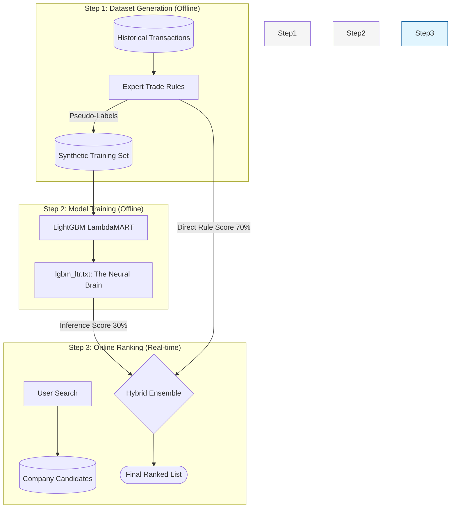

# Learn to Rank (LTR) Architecture Analysis

## What is Learn to Rank?
Learn to Rank (LTR) is a class of machine learning techniques that applies supervised learning to solve ranking problems. Unlike standard classification (Is this a cat?) or regression (What is the price?), LTR cares about the **relative order** of items in a list.

---

## Comparative Architecture: Knowledge-Driven vs. Data-Driven LTR

```mermaid
graph LR
    subgraph "Standard Data-Driven (Future Goal)"
        Clicks[("Implicit Feedback: User Clicks")] -- "Future Path" -.-> LabelsA["Ground Truth"]
    end

    subgraph "ZaraiLink Knowledge-Driven (CURRENT)"
        Expert["Expert Heuristics: Domain Rules"] -- "Pseudo-Labeling" --> LabelsB["Silver Standard Labels"]
        FeaturesB["Feature Extraction: Domain-Specific"] --> ModelB["LTR Model: LambdaMART"]
        LabelsB --> ModelB
    end

    ModelB --> RankB["Hybrid Ensemble Score"]
    Expert -->|Primary Weight 70%| RankB
    ModelB -->|Secondary Weight 30%| RankB

    style Expert fill:#f96,stroke:#333,stroke-width:2px
    style Clicks fill:#ddd,stroke:#999,stroke-dasharray: 5 5
```

---

## Deep Dive: The Synthetic Dataset & Pseudo-Labeling

In a standard LTR system, you use **Real Clicks**. In ZaraiLink, we use **Synthetic Data**.

### 1. What is the usual LTR flow? (Industry Standard)
In companies like Netflix or Amazon, the flow is:
- **User clicks** "Buy" on Item A.
- The system records: "For Query X, Item A is highly relevant (Label = 1)."
- Over millions of clicks, you get a **Training Set** of what humans actually like.

### 2. What is "Pseudo-Labeling"? (The ZaraiLink Approach)
Since we don't have users yet, we had to "pretend" to be a perfect user.
- **Pseudo-Labeling** means we use a **Mathematical Formula** (the Expert Rules) to assign a "Relevance Grade" to companies automatically.
- We act as the "Teacher" who tells the AI: *"Based on math, Company A is a 5-star result, and Company B is a 2-star result."*

### 3. How did we make the Dataset? (`LTRDatasetBuilder`)
Our code follows this automated pipeline:
1.  **Query Simulation:** The builder generates thousands of "Fake Queries" (e.g., "Find exporters for Rice over 100MT").
2.  **Historical Retrieval:** For each fake query, it pulls real data from the **Transaction Database** to see who actually traded those products in the past.
3.  **Feature Extraction:** It calculates metrics for those companies (How much they traded? How recently?).
4.  **The Labeling Step:** 
    - It uses the **Expert Rules** to calculate a raw score for each company.
    - It then **Bins** these scores: The top 20% of companies get a **Label of 4** (Perfect), the next 20% get a **3**, and so on.
5.  **Output:** This results in a massive table of **Features + Labels** that we feed into the **LightGBM** trainer.

---

## Technical Definition: LambdaRank
We use the **LambdaRank** objective within LightGBM. Instead of teaching the AI to predict a number, we teach it to **Rank a List**. The AI's only goal is to minimize the "reordering" errors (e.g., it gets penalized if it puts a 2-star result above a 4-star result).
### Explaining the Reality:
- **Heuristic Supervision (The "Teacher"):** Because we are in a "Cold Start" Phase (no users yet), we use trade mathematical rules to **teach** the AI.
- **Silver Standard Labels:** Instead of real user data, our training data is "Silver" (expert-made) rather than "Gold" (user-made).
- **The Click Log (Future):** We have built the *pipes* for click logs, but they are not currently driving the model training.

## The LTR Bootstrapping Pipeline (How it's built)

This diagram shows the 100% accurate flow of how we built the intelligence in ZaraiLink.



### Explaining the Process:
1.  **Synthetic Labeling:** Since we don't have user clicks yet, we use **Historical Transactions** and **Expert Rules** (like "Volume is good") to label companies. We call this "Pseudo-Labeling."
2.  **LambdaMART Training:** We use a high-performance algorithm called **LambdaMART** (via LightGBM) to learn these rules. It results in a small file (`lgbm_ltr.txt`) that acts as the search engine's "Brain."
3.  **Hybrid Ensemble:** When a user searches, we check the results using both the **AI Model** and the **Original Rules**. We combine them (70% Rules / 30% AI) to ensure the search is both smart and safe.

---

## Why did we implement LTR? (The Rationale)

Evaluators will ask: *"What was the need for a complex AI model? Why not just sort by volume?"*

1.  **Multidimensional Balancing:** It is impossible to manually determine the perfect "balance" between 6 different business factors (price vs volume vs recency) in a single SQL query. LTR uses **LambdaMART** to find that mathematical sweet spot.
2.  **Addressing the "Cold Start":** Most search engines need millions of clicks to learn. Our architecture uses **Heuristic Supervision** (Rules + AI) to be intelligent from Day 1.
3.  **Self-Learning (Future-Proof):** We built the "pipes" now so that when real users start clicking, the model can update itself automatically. We won't have to rewrite any code to make it "smarter."

### The "Expert Rules" (What the AI learned)
The AI was trained on a **Synthetic Dataset** using these 6 high-level trade rules:

| Rule (Feature) | What it specifically measures |
| :--- | :--- |
| **Volume Fit** | Does their typical shipment size match what the user is asking for? |
| **Trade Velocity** | How frequently does this company trade? (higher = more reliable) |
| **Trade Recency** | How many days since their last major shipment? (lower = more active) |
| **Global Scale** | Their total historical trade volume (in Metric Tons). |
| **Geo-Relevance** | Is the company located in the origin country the user requested? |
| **Price Consistency** | Does their price history match the user's "Budget" (Price Ceiling)? |

---

## Technical Comparison

| Feature | ZaraiLink "Cold Start" LTR | Standard Industry LTR |
| :--- | :--- | :--- |
| **Learning Signal** | **Expert Rules** (Pseudo-Labels) | **User Clicks** (Implicit Feedback) |
| **Algorithm** | **LambdaMART** (LightGBM) | Deep Neural Networks (DNN) |
| **Safeguard** | **Hybrid Ensemble** (AI + Rules) | Pure Model Output |

---

## Presentation Cheat Sheet
- **What it is:** A semi-supervised learning system for search ranking.
- **The "How":** We used **Expert Trade Rules** to teach a **LambdaMART** model how to rank candidates.
- **The "Why":** To go beyond "exact matches" and provides "smart" results that balance reliability, price, and volume.
