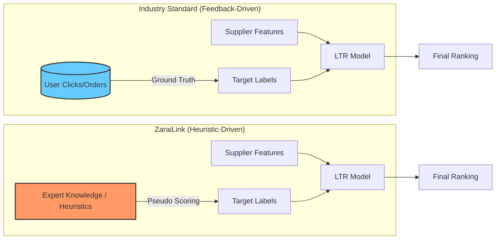

# Learn to Rank (LTR) Architecture Analysis

## What is Learn to Rank?
Learn to Rank (LTR) is a class of machine learning techniques that applies supervised learning to solve ranking problems. Unlike standard classification (Is this a cat?) or regression (What is the price?), LTR cares about the **relative order** of items in a list.

---

## Comparative Architecture: Industry vs. ZaraiLink

This diagram shows how we replaced the "Human Feedback Loop" with a "Heuristic Knowledge Loop" to bypass the lack of initial user data.

---

## Why did we do it this way?

We chose this **"Heuristic-to-Model"** approach for three critical reasons:

### 1. The "Cold Start" Problem
In a new platform, you have zero click data. If you wait for months to collect enough clicks to train a model, your search remains "dumb" during the most critical early growth phase. By using heuristics (Volume, Recency, Price) as a "Teacher," we give the model a starting point (V0) so the search is intelligent from Day 1.

### 2. Generalization
A simple sorting algorithm (e.g., `ORDER BY volume`) is rigid. A Machine Learning model trained on those same rules is "softer." It learns the *weighted relationships* between features. This allows it to handle edge cases—like a supplier with slightly lower volume but much better recency—more gracefully than a hard-coded script could.

### 3. Future-Proofing (The Bridge)
The architecture we built is a bridge. 
- **Today:** The `PseudoLabelGenerator` feeds simulated "ideal" rankings to the model.
- **Tomorrow:** We simply swap the `PseudoLabelGenerator` with a "Click Log Processor." 

Because the rest of the pipeline (Feature Extraction, LightGBM Inference, Ensemble) is already in place, upgrading the "brain" will require zero changes to the core search infrastructure.

### The 3 Stages of LTR Inference
1.  **Retrieval (Recall):** Quickly narrowing down millions of documents to a few hundred using cheap algorithms (like keyword matching or vector search).
2.  **Scoring (Precision):** Using the LTR model to re-rank those few hundred candidates using expensive math and many features.
3.  **Post-Processing:** Applying business rules (e.g., "don't show duplicate products").

---

## Comparison: Industry Standard vs. ZaraiLink

Our current implementation is a **"Cold Start" LTR Architecture**. Since we don't have years of user click logs yet, we use **Heuristics** to teach the model.

| Feature | Industry Standard | ZaraiLink Implementation |
| :--- | :--- | :--- |
| **Labels (y)** | **Implicit Feedback**: Derived from real user clicks and purchases. | **Pseudo-Labels**: Derived from a "Gold Standard" heuristic score. |
| **Retrieval** | Multi-stage (Elasticsearch -> LTR). | SBERT Vector Search -> LTR. |
| **Training** | Continuous online retraining. | Manual offline training script (`train_ltr.py`). |
| **Model** | Complex Gradient Boosted Trees or DNNs. | **LightGBM (LambdaRank)** - State of the art for tabular ranking. |
| **Ensemble** | Often pure model output. | **Hybrid Ensemble**: 70% Heuristic + 30% Model (Safeguard). |

### Why did we choose this approach?
In industry, the biggest challenge is the "Cold Start": how do you rank if you have no clicks? 
1.  **The Labeler:** We built a `PseudoLabelGenerator` that acts as a "Teacher." It uses our best business knowledge (Volume + Recency + Price) to create labels.
2.  **The Student:** The `lgbm_ltr.txt` model is the "Student." It generalizes the teacher's rules so it can handle edge cases the teacher might miss.
3.  **The Evolution:** As ZaraiLink grows and users start clicking, we can replace the **Pseudo-Labels** with **Real Clicks**, making the system truly "intelligent" without changing the code structure.

---

## How ZaraiLink LTR Works (End-to-End)

1.  **Input:** Your query (e.g., "High volume sugar").
2.  **Features:** Our `FeatureExtractor` looks at each supplier's `log_volume`, `days_since_last_trade`, and `price_fit`.
3.  **Brain:** The `lgbm_ltr.txt` file (binary decision trees) processes these numbers.
4.  **Result:** It outputs a relevance score that ranks a small-scale reliable supplier higher if the query emphasizes "Reliability" over "Volume."
