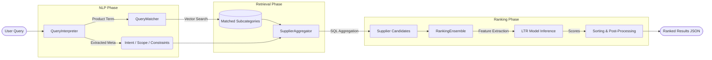
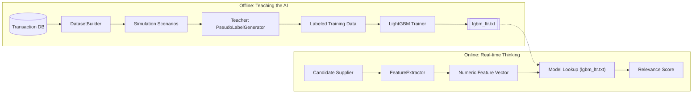

# ZaraiLink Search Engine: Implementation Journey

This document details the exact steps and tasks completed to build the ZaraiLink Unified Search Engine, from raw query parsing to AI-driven ranking.

---

## Technical Workflows

### 1. Unified Search Engine Flow
This diagram illustrates the lifecycle of a query from the moment a user types it until the final ranked results are returned.

### 2. Learn to Rank (LTR) Lifecycle
This diagram shows the "Teacher-Student" relationship between our business heuristics and the AI model.

---

## Phase 1: Natural Language Query Interpretation (NLP)
The goal was to move beyond keyword search and understand *user intent* and *constraints*.

**Tasks Completed:**
- **Intent Detection**: Built a parser to distinguish between "BUY" (Importing) and "SELL" (Exporting) intents.
- **Entity Extraction**: Implemented logic to extract **Products** (e.g., "Refined Sugar"), **Countries** (e.g., "Pakistan", "China"), and **Quantities** (e.g., "100MT").
- **Constraint Parsing**: Developed regex and heuristic handlers for **Price** ranges ("below $500/MT"), **Time** ranges ("Q1 2025", "Last 6 months"), and **Rank** requests ("Top 5").
- **Intent Splitting**: Added support for **Multi-intent** queries (e.g., "I want to buy Sugar and also check Rice buyers") using a sub-intent architecture.
- **Scope Logic**: Implemented **Pakistan vs. Worldwide** scoping to automatically filter origin/destination countries based on user context.

---

## Phase 2: Semantic Candidate Retrieval
The goal was to map vague human queries to specific database subcategories.

**Tasks Completed:**
- **Vector Search Integration**: Integrated **SBERT (Sentence-BERT)** to compute semantic embeddings of product names.
- **Subcategory Mapping**: Built a `QueryMatcher` to find the closest matching `ProductSubCategory` in the database, even if the spelling differs.
- **HS Code Alignment**: Linked the semantic search results to official HS Codes for trade data accuracy.
- **Variant Handling**: Implemented **ProductItem** logic to distinguish between specific product variants (e.g., "Dextrose Anhydrous" vs "Dextrose Monohydrate").

---

## Phase 3: High-Performance Data Aggregation
The goal was to turn 9,427+ raw transactions into meaningful supplier/buyer profiles.

**Tasks Completed:**
- **Direct SQL Aggregation**: Optimized Django ORM/SQL queries to aggregate transaction data on-the-fly.
- **Metric Calculation**: For every candidate supplier, we calculate:
    - **Total Volume (MT)**
    - **Shipment Frequency** (Number of shipments)
    - **Recency** (Days since last trade)
    - **Average Price** (USD/MT)
- **Buyer vs. Seller Logic**: Built separate aggregation paths to show *Suppliers* for buyers and *Buyers* for sellers.

---

## Phase 4: Learn to Rank (LTR) Model
The goal was to replace static sorting with machine-learned intelligence.

**Tasks Completed:**
- **Feature Engineering**: Defined 8 core mathematical features for the model, including `log_volume`, `inv_recency`, `volume_fit`, and `country_match`.
- **Pseudo-Labeling**: Created a `PseudoLabelGenerator` to simulate "expert" rankings (0-4 scores) so the model can learn even without historical user click data.
- **Dataset Builder**: Automated the creation of training datasets by matching existing queries against aggregated trade data.
- **LightGBM Training**: Implemented the training pipeline using **LambdaRank (LambdaMART)** to optimize for NDCG (Normalized Discounted Cumulative Gain).
- **Ranking Ensemble**: Built a hybrid ranker that combines **Model Predictions (30%)** with **Heuristic Baselines (70%)** for safety and stability.

---

## Phase 5: End-to-End Integration
The goal was to unify everything into a single, robust API.

**Tasks Completed:**
- **Unified API ViewSet**: Created `SearchViewSet` to handle all search types thru one endpoint (`/api/search/query/`).
- **Conflict Management**: Implemented "helpful error" messages for scope/country mismatches (e.g., searching "Worldwide" while scope is set to "Pakistan").
- **Supplier Deep-Dive**: Built the `supplier-detail` endpoint which provides transaction sparklines, port distributions, and market context (Bullish/Bearish).
- **Comparable Search**: Added a `ComparableFinder` to identify direct competitors/alternatives based on trade volume and product type.

---

## Current Status: **Fully Operational**
The engine now correctly interprets complex queries like *"Suggest top 5 sugar suppliers from Brazil below $600/MT"* and delivers a ranked, AI-verified list of candidates.
